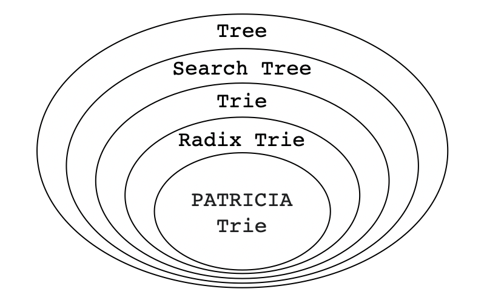
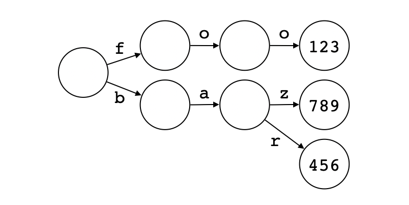

# 深入理解以太坊存储（一）：Trie

本文是“深入理解以太坊存储”系列的第一篇文章。在准备这个系列的时候，以太坊2.0信标链已经正式上线。在写这篇文章的时候，比特币价格已经突破前高，并且飙升到了24000$一枚。

这个系列的目的是帮助读者彻底理解以太坊底层的存储结构和实现方式，为后续更多的以太坊系列做好准备。这一系列可以分为三个部分。第一部分做一些必要的铺垫，介绍trie、radix trie、patricia tree、merkle tree等基本数据结构，共4篇文章。第二部分介绍如何基于KV存储将trie和merkle tree合二为一，共2篇文章。前两部分和以太坊没有太大关系，所以即使是对以太坊不感兴趣的小伙伴也可以阅读并从中受益。第三部分进入正题，介绍以太坊merkle patricia tree（简称MPT树）的实现以及应用（具体的文章还在规划中）。下面是目前已经规划好的文章列表：

* 深入理解以太坊存储（一）：Trie

* 深入理解以太坊存储（二）：Radix Trie

* 深入理解以太坊存储（三）：Patricia Trie

* 深入理解以太坊存储（四）：Merkle Tree

* 深入理解以太坊存储（五）：Merkle Trie

* 深入理解以太坊存储（六）：Merkle Radix Trie

* 深入理解以太坊存储（七）：Merkle Patricia Trie


> "Talk is cheap. Show me the code." ― Linus Torvalds

本系列文章并不是只有空洞的文字，还有可执行的（Go语言）代码。数据结构是抽象的，如果结合具体的代码则可以更好的理解它们。这一系列文章的配套代码可以在[这里](https://github.com/zxh0/blog/code/go/mympt)找到。


## 从Trie说起

学习过数据结构的读者都知道，[Trie](https://en.wikipedia.org/wiki/Trie)（也叫Prefix Tree）是一种[树](https://en.wikipedia.org/wiki/Tree_data_structure)，更具体的说，是一种[查找树](https://en.wikipedia.org/wiki/Search_tree)。本文首先介绍trie，下一篇文章会介绍优化后的[Radix Trie](https://en.wikipedia.org/wiki/Radix_tree)，再下一篇文章会介绍Radix Trie的一个变种：[PATRICIA Trie](https://en.wikipedia.org/wiki/Radix_tree#Variants)。这些数据结构都很基础，基本上所有介绍数据结构书都会讲到，网上也有很多很好的介绍性文章，本文就不再啰嗦细节了。下面是这几种树的关系图：



本文的主角是trie，这个奇怪的名字来自单词re**trie**val，这个数据结构早在1960年左右就被计算机先驱们提出来了。查找树经常被用来实现[关联数组](https://en.wikipedia.org/wiki/Associative_array)，以下面这个简单的关联数组（用JSON格式表示）为例：

```json
{
  "foo": 123,
  "bar": 456,
  "baz": 789,
}
```

用trie来实现的话，内部状态看起来是下面这样（注意，在计算机科学中，树一般是竖着画的，根节点在最上面，叶子节点在最下面，这里为了看起来好看一些，所以横着画了，根节点在最左边）：



不难看出，除了查找树的一般特征，trie有自己的特点。

第一，节点不需要显式存储键（Key），只需要存储值（Value）即可。从根节点到某个含有值的节点形成一个路径，这个路径就是键。给定一个键，按路径依次访问子节点即可进行查找。如果要遍历键值对，只要遍历树，找到所有含有值的节点即可。

第二，很多时候空间利用率并不高。比如上面这个例子，每个非叶子节点都只有一两个子节点，且大部分节点都没有值。Radix tree在空间利用率方面进行了优化，我们将下一篇文章中详细讨论。

如果读者对trie并不是很了解，觉得上面的描述不知所云也没关系。接下来我们将使用Go语言实现一个简单的trie，帮助读者理解这个非常有用的数据结构。


## 定义SearchTree接口

根据前面的介绍，我们可以定义一个最简单的`SearchTree`接口。这个接口看起来就像一个哈希表，只有3个方法，分别进行插入、查找、遍历操作：

```go
type SearchTree interface {
	Put(key string, val uint)
	Get(key string) uint
	ForEach(cb func(key string, val uint))
}
```

为了简单起见，我们将`key`限定为`string`类型，将`val`限定为`uint`类型。并且我们约定`key`必须是长度大于0的ASCII字符串，`val`必须大于0。当调用`Put()`方法时，如果传入的`val`为0，则表示删除操作。当调用`Get()`方法时，如果返回值为0表示查找失败。`ForEach()`方法的唯一参数是个无返回值的回调（Callback）函数。


## 定义节点

一颗树由根节点和分叉出来的子树构成，每棵子树又是由它自己的根节点和更小的子树构成。因此，很自然的，可以使用递归结构体来定义trie的节点：

```go
type TrieNode struct {
	Val  uint                 `json:"val,omitempty"`
	Kids map[string]*TrieNode `json:"kids,omitempty"`
}
```

字段`Val`存放值，没什么好说的。字段`Kids`存放分支节点，如何定义它就有很大的灵活性了。前面我们假定key是ASCII字符串，所以一个trie节点最多只能有128（2<sup>7</sup>）个节点，因此完全可以把`Kids`字段定义成数组（`[128]*TrieNode`）或者切片（`[]*TrieNode`）类型。不过为了简化实现，我们把`Kids`定义成了`map`类型。基于同样的原因，我们可以把`Kids`字段的键定义成`byte`类型（`map[byte]*TrieNode`）。不过为了便于打印观察，我们使用了`string`类型（长度始终为1）。定义好结构体之后，可以再定义一个函数创建trie实例：

```go
func NewTrie() SearchTree {
	return &TrieNode{}
}
```

目前这个函数还无法通过编译，因为`TrieNode`结构体还没有实现`SearchTree`接口。马上就来解决。


## 插入/更新/删除

`TrieNode`是递归结构体，插入/查找/遍历操作也是用递归方式比较容易实现。我们的目标是代码简单易读，而非效率。先来看插入操作：

```go
func (node *TrieNode) Put(key string, val uint) {
	if key == "" {
		node.Val = val
	} else {
		kid := node.findOrCreateKid(key[:1])
		kid.Put(key[1:], val)
	}
}
```

如果`key`是空字符串，说明已经找到了目标节点，设置它的`Val`字段即可。如果操作之前节点`Val`字段的值等于0，则是插入操作，否则是更新操作。如果传入的`val`是0，相当于删除操作（很显然，节点还留在树上，如果节点没有子节点的话，可以彻底删除这个节点，这个优化就留给读者了）。如果`key`非空，那么我们根据第一个ASCII字符找到或创建一个子节点，然后调用子节点的`Put()`方法完成操作。下面是`findOrCreateKid()`方法的代码：

```go
func (node *TrieNode) findOrCreateKid(char string) *TrieNode {
	if node.Kids == nil {
		node.Kids = make(map[string]*TrieNode)
	}
	if node.Kids[char] == nil {
		node.Kids[char] = &TrieNode{}
	}
	return node.Kids[char]
}
```


## 查找

相比于写入，查找就简单了：

```go
func (node *TrieNode) Get(key string) uint {
	if key == "" {
		return node.Val
	}
	if kid, found := node.Kids[key[:1]]; found {
		return kid.Get(key[1:])
	}
	return 0
}
```

如果`key`是空，说明已经找到了目标节点，返回节点的`Val`字段值即可。否则，根据`key`的第一个字符查找子节点。如果找到了子节点，调用子节点的`Get()`方法继续查找。否则查找结束，返回0。


## 遍历

遍历操作稍微有点复杂，因为我们需要在遍历过程中把`key`恢复出来，请看代码：

```go
func (node *TrieNode) ForEach(cb func(string, uint)) {
	if node.Val > 0 {
		cb("", node.Val)
	}
	for _, char := range utils.GetSortedKeys(node.Kids) {
		kid := node.Kids[char]
		kid.ForEach(func(key string, val uint) {
			cb(char+key, val)
		})
	}
}
```

如果节点的`Val`字段值大于0，说明找到了一个值，调用回调函数。否则，依次调用每一个子节点的`ForEach()`方法继续遍历操作。请注意我们传递给子节点`ForEach()`方法的回调函数是经过包装的，目的就是恢复完整的`key`。另外请注意，Go的`map`是无法预测遍历顺序的，因此我们对子节点进行了排序。辅助函数`GetSortedKeys()`使用反射提取`map`的所有键（必须是字符串类型），进行排序后返回，代码如下所示：

```go
func GetSortedKeys(i interface{}) []string {
	v := reflect.ValueOf(i)
	keys := make([]string, v.Len())
	for j, k := range v.MapKeys() {
		keys[j] = k.String()
	}

	sort.Strings(keys)
	return keys
}
```


## 测试

到这里我们设计的trie就基本实现好了，可以写个简单的测试看看效果：

```go
func TestTrie(t *testing.T) {
	trie := NewTrie()
	trie.Put("foo", 123)
	trie.Put("bar", 456)
	trie.Put("baz", 789)
	require.Equal(t, uint(123), trie.Get("foo"))
	require.Equal(t, uint(456), trie.Get("bar"))
	require.Equal(t, uint(789), trie.Get("baz"))
	trie.ForEach(func(key string, val uint) {
		println(key, ":", val)
	})
	println(utils.ToPrettyJSON(trie))
}
```

运行测试，目测是没啥问题（如果读者发现代码有bug，欢迎指出，我会修改bug并更新文章）。为了便于观察，我们通过辅助函数`ToPrettyJSON()`将整棵树的内部状态以`JSON`形式打印了出来，下面是它的代码：

```go
func ToPrettyJSON(v interface{}) string {
	bytes, _ := json.MarshalIndent(v, "", "  ")
	return string(bytes)
}
```

下面是树的完整状态（稍微调整了一下格式），可以结合前面的示意图对比着看：

```json
{
  "kids": {
    "b": {
      "kids": {
        "a": {
          "kids": {
            "r": { "val": 456 },
            "z": { "val": 789 }
          }
        }
      }
    },
    "f": {
      "kids": {
        "o": {
          "kids": {
            "o": { "val": 123 }
          }
        }
      }
    }
  }
}
```


## 总结/广告

Trie是一种常用的查找树，可以用它来实现关联数组（键通常为字符串）。本文简单介绍了查找树和trie，并用Go语言实现了一个简化版的trie。Trie的一个缺点是空间利用率不高（特别是键比较分散的时候），下一篇文章将要介绍的radix trie对这个问题进行了优化。

如果你喜欢这种循序渐进、文字+可执行代码结合的写作风格的话，那么作者写的三本书一定不要错过。感兴趣的读者请关注《自己动手写Java虚拟机》、《自己动手实现Lua》和《WebAssembly原理与核心技术》。


