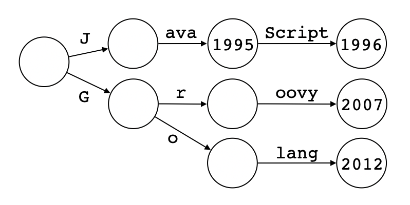

# 深入理解以太坊存储（二）：Radix Trie

前一篇文章介绍了数据结构[trie](https://en.wikipedia.org/wiki/Trie)，并用Go语言实现了一个简化版的trie。由前一篇文章可知，trie最大的问题是空间利用率不高（尤其是键比较长的时候）。这一篇文章我们来讨论trie的优化版：[radix tree](https://en.wikipedia.org/wiki/Radix_tree)。


## Radix Trie介绍

我们已经知道，trie又叫做前缀树（prefix tree）。而radix trie又叫做紧凑前缀树（compact prefix tree）。名字已经非常直白了，那么和trie相比，radix trie到底是如何紧凑（更高效的利用空间）的呢？用一句话总结就是：如果一个节点仅有一个子节点，那么就把这两个节点合并。我们还是来看一个例子：

```json
{
  "Java": 1995,
  "JavaScript": 1996,
  "Groovy": 2007,
  "Golang": 2012
}
```

这是一个映射表（用JSON格式表示），键是几种主流编程语言的名称，值是这些语言正式发布（1.0版）的年份（注：Java 1.0其实也是1996年才发布的，不过为了和JavaScript区分，本文选用了Java 1.0a2发布的年份）。如果把这个映射表转换成trie，看起来是下面这样（按惯例树应该竖着画，本文为了好看横着画了）：


可以看到，大部分的节点都只有一个子节点，这就有很大的优化空间了。我们从叶子节点开始，按照前面介绍的优化方法合并节点，最终就可以得到一课radix trie，看起来是下面这样（的确是更紧凑了）：



关于radix trie的理论知识就先介绍到这里，如果读者还不是很理解，可以参考数据结构相关书籍或者在网上搜索相关文章，本文就不再啰嗦了。接下来我们进入实践环节，还是用Go语言来实现一个简化版的radix trie。这一系列文章的配套代码可以在[这里](https://github.com/zxh0/blog/code/go/mympt)找到。


## 定义节点

在前一篇文章中，为了实现trie，我们定义了`TrieNode`结构体。本文将对`TrieNode`进行改进，实现radix trie。所以如果读者还没有看过前一篇文章，一定要先去看看呀。下面是`RadixTrieNode`结构体的定义：

```go
type RadixTrieNode struct {
	Prefix string                    `json:"prefix,omitempty"`
	Val    uint                      `json:"val,omitempty"`
	Kids   map[string]*RadixTrieNode `json:"kids,omitempty"`
}
```

和`TrieNode`结构体相比，`RadixTrieNode`结构体多了一个`Prefix`字段，用来存储合并起来的路径（稍后会详细解释），其他字段就不再赘述了。和上一篇文章一样，我们仍然假设键是ASCII字符串，值是无符号整数。当我们对键进行比较时，实际上是按ASCII字符（粗略的说就是字节）比较，每次对比256（2<sup>8</sup>）个比特。也就是说，节点的子节点不超过256个。换句话说，我们定义的radix trie的radix是256。`RadixTrieNode`结构体也会实现`SearchTree`接口，下面这个函数新建一棵空的radix trie：

```go
func NewRadixTrie() SearchTree {
	return &RadixTrieNode{}
}
```

然后我们还是按照插入、查找、遍历的顺序来实现`SearchTree`接口定义的方法。


## 插入

先从最简单的情况开始：往空的radix trie中插入数据。此时只有一个根节点，所以直接设置根节点的`Prefix`和`Val`字段即可。否则，如果节点的`Prefix`和传入的`key`相等，那么直接更新节点的`Val`字段即可。下面是`Put()`方法的部分代码：

```go
func (node *RadixTrieNode) Put(key string, val uint) {
	if node.Prefix == "" && node.Val == 0 && node.Kids == nil { // empty node
		node.Prefix, node.Val = key, val
		return
	}
	if node.Prefix == key {
		node.Val = val
		return
	}
	...
}
```

以上是最简单的两种情况。我们再来看一种情况：节点的`Prefix`是传入的`key`的前缀。为了简化讨论，我们用带方括号的`[prefix:val]`来表示一个节点；用不带方括号的`key:val`来表示键值对。假设当前节点是`[Java:1995]`，要插入的键值对是`JavaScript:1996`。在这种情况下，直接增加一个子节点即可，如下图所示（黑色粗箭头左边是操作之前的状态，右边是操作之后的状态）：


我们把上图的逻辑写进`Put()`方法里，代码如下所示（使用了递归）：

```go
func (node *RadixTrieNode) Put(key string, val uint) {
	...
	n := utils.CommonPrefixLen(node.Prefix, key)
	...
	if len(key) > n {
		kid := node.findOrCreateKid(key[n : n+1])
		kid.Put(key[n+1:], val)
	}
	...
}
```

`CommonPrefixLen`是一个辅助函数，计算两个字符串的公共前缀的长度，下面是它的代码:

```go
func CommonPrefixLen(s1, s2 string) int {
	n1, n2 := len(s1), len(s2)
	i := 0
	for ; i < n1 && i < n2; i++ {
		if s1[i] != s2[i] { break; }
	}
	return i
}
```

`findOrCreateKid()`方法和前一篇文章`TrieNode`结构体里的实现基本上是一样的（其实就是拷贝过来，把结构体名改一下而已），下面是它的代码：

```go
func (node *RadixTrieNode) findOrCreateKid(char string) *RadixTrieNode {
	if node.Kids == nil {
		node.Kids = make(map[string]*RadixTrieNode)
	}
	if node.Kids[char] == nil {
		node.Kids[char] = &RadixTrieNode{}
	}
	return node.Kids[char]
}
```

我们再来看第四种情况：传入的`key`是节点`Prefix`的前缀。例如当前节点是`[JavaScript:1996]`，要插入的键值对是`Java:1995`。这种情况我们可以分两步处理：先拆分出来一个子节点，然后设置节点的`Val`字段，如下图所示（黑色粗剪头的上面是第一步操作，下面是第二步操作）：


我们把上图的逻辑写进`Put()`方法里，代码如下所示：

```go
func (node *RadixTrieNode) Put(key string, val uint) {
	...
	n := utils.CommonPrefixLen(node.Prefix, key)
	if len(node.Prefix) > n {
		node.split(n)
	}
	...
	node.Val = val
}
```

节点的分裂逻辑在`split()`方法里，代码如下所示：

```go
func (node *RadixTrieNode) split(n int) {
	node.Kids = map[string]*RadixTrieNode{
		node.Prefix[n : n+1]: {
			Prefix: node.Prefix[n+1:],
			Val:    node.Val,
			Kids:   node.Kids,
		},
	}
	node.Prefix = node.Prefix[:n]
	node.Val = 0
}
```

现在只剩下最后一种情况了：传入的`key`和节点的`Prefix`有公共的前缀。例如当前节点还是`[JavaScript:1996]`，但是要插入的键值对是`Java15:2020`。这种情况也是分两步处理：先拆分节点，然后新增一个子节点（其实前一种情况只是这种情况的特例而已），如下图所示：


下面给出`Put()`方法完整的代码：

```go
func (node *RadixTrieNode) Put(key string, val uint) {
	if node.Prefix == "" && node.Val == 0 && node.Kids == nil {
		node.Prefix, node.Val = key, val
		return
	}

	if node.Prefix == key {
		node.Val = val
		return
	}

	n := utils.CommonPrefixLen(node.Prefix, key)
	if len(node.Prefix) > n {
		node.split(n)
	}
	if len(key) > n {
		kid := node.findOrCreateKid(key[n : n+1])
		kid.Put(key[n+1:], val)
	} else {
		node.Val = val
	}
}
```


## 查找

相比插入操作，查找操作就简单一些了，下面是`Get()`方法的代码：

```go
func (node *RadixTrieNode) Get(key string) uint {
	if key == node.Prefix {
		return node.Val
	}
	if node.Kids != nil {
		n := utils.CommonPrefixLen(node.Prefix, key)
		if n == len(node.Prefix) {
			if kid, found := node.Kids[key[n:n+1]]; found {
				return kid.Get(key[n+1:])
			}
		}
	}
	return 0
}
```

如果传入的`key`和节点的`Prefix`相同，查找成功，返回节点的`Val`。否则，如果节点有子节点且`key`是节点`Prefix`的前缀，尝试找到子节点，然后在子节点上递归调用`Get()`方法继续查找。否则，查找失败，返回0。


## 遍历

遍历操作也比较简单，下面是`ForEach()`方法的代码：

```go
func (node *RadixTrieNode) ForEach(cb func(string, uint)) {
	if node.Val > 0 {
		cb(node.Prefix, node.Val)
	}

	for _, char := range utils.GetSortedKeys(node.Kids) {
		kid := node.Kids[char]
		kid.ForEach(func(key string, val uint) {
			cb(node.Prefix+char+key, val)
		})
	}
}
```

这个方法看起来也是非常熟悉的（不熟悉的读者请复习前一篇文章😊）。如果节点的`Val`字段值大于0，说明找到了一个值，调用回调函数。否则，依次调用每一个子节点的`ForEach()`方法继续遍历操作。这个方法的重点仍然是如何在遍历过程中把键恢复出来，请读者仔细观察。辅助函数`GetSortedKeys()`的代码已经在前一篇文章中给出，此处不再赘述。


## 测试

到这里radix trie就基本实现好了，我们还是写一个简单的测试来看看效果：

```go
func TestRadixTrie(t *testing.T) {
	trie := NewRadixTrie()
	trie.Put("Java", 1995)
	trie.Put("JavaScript", 1996)
	trie.Put("Groovy", 2007)
	trie.Put("Golang", 2012)
	require.Equal(t, uint(1995), trie.Get("Java"))
	require.Equal(t, uint(1996), trie.Get("JavaScript"))
	require.Equal(t, uint(2007), trie.Get("Groovy"))
	require.Equal(t, uint(2012), trie.Get("Golang"))
	trie.ForEach(func(key string, val uint) {
		println(key, ":", val)
	})
	println(utils.ToPrettyJSON(trie))
}
```

测试通过，应该是没啥问题（如果读者发现代码有bug，欢迎指出，我会修改bug并更新文章）。为了便于观察，我们通过辅助函数`ToPrettyJSON()`（代码在上一篇文章中已经给出）将整棵树的内部状态以`JSON`形式打印出来，可以结合前面的示意图对比着看：

```json
{
  "kids": {
    "G": {
      "kids": {
        "o": {
          "prefix": "lang",
          "val": 2012
        },
        "r": {
          "prefix": "oovy",
          "val": 2007
        }
      }
    },
    "J": {
      "prefix": "ava",
      "val": 1995,
      "kids": {
        "S": {
          "prefix": "cript",
          "val": 1996
        }
      }
    }
  }
}
```


## 总结/广告

Radix trie对trie进行了改进，优化了空间利用率。本文对radix trie进行了简要介绍，并且给出了Go语言版的简化实现（radix=256）。在下一篇文章中，我们将讨论radix trie的一个变种：PATRICIA trie。如果你喜欢这种循序渐进、图文+可执行代码结合的写作风格的话，那么作者写的三本书一定不要错过。感兴趣的读者请关注[《自己动手写Java虚拟机》](https://e.jd.com/30231161.html?ebook=1)、[《自己动手实现Lua》](https://item.jd.com/12458778.html)和[《WebAssembly原理与核心技术》](https://item.jd.com/12998058.html)。


