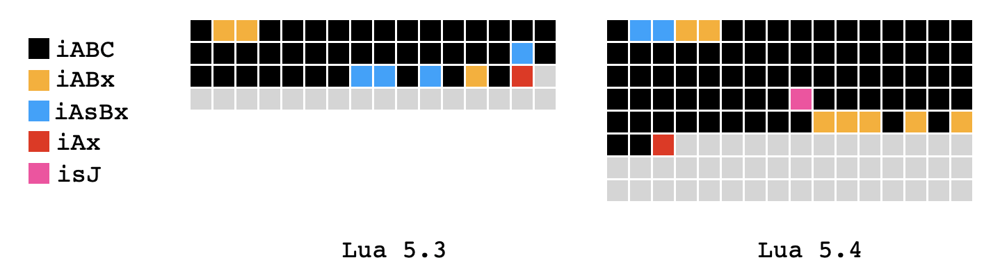
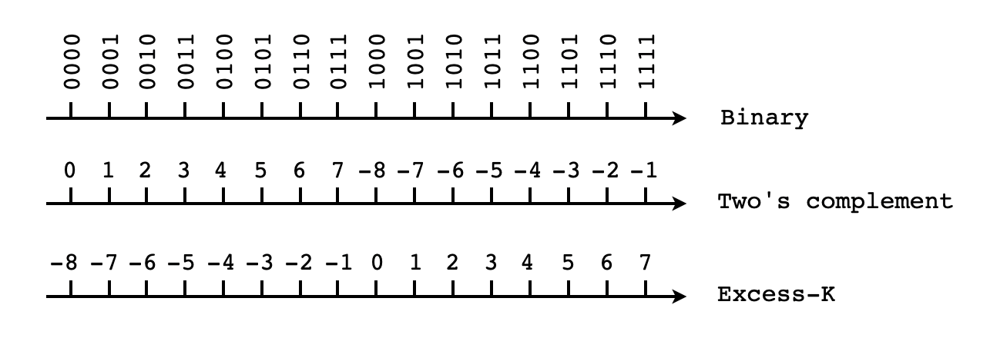

# Lua 5.4之指令编码格式

本文是Lua 5.4系列的第二篇文章。在第一篇文章中，我们讨论了Lua 5.4二进制块（Binary Chunk）在整体格式上的变化。由于变长整数的使用以及其他一些优化，Lua 5.4二进制块总体上变得更加紧凑了。虚拟机指令的长度在Lua 5.4中并没有变化，仍然是32比特，然而指令的编码格式却发生了较大的变化。本文将详细介绍Lua 5.4虚拟机指令编码格式的变化，虚拟机指令集的变化将在下一篇文章中介绍。本文章假定读者已经了解Lua 5.3虚拟机和指令集，如果还不是很了解，可以参考文末给出的学习资料。


## 基本格式

Lua 5.3虚拟机采用定长指令，每条指令固定长4个字节，这一点在Lua 5.4中没有变化。在Lua实现代码中，指令被定义为32位无符号整数。在本文中，我们用类似下面这样的方框图来表示一条Lua虚拟机指令（左边是最高位，右边是最低位）：

```
Lua 5.3 & 5.4 :

31    24      16       8       0
┌------┐┌------┐┌------┐┌------┐
|      ||      ||      ||      |
└------┘└------┘└------┘└------┘
```


## 操作码

和Java、WebAssembly等虚拟机一样，Lua虚拟机指令也分为两个部分：操作码（Opcode）和静态参数（Static  Arguments，简称参数）。指令在执行时，通常还需要动态参数，一般称之为操作数（Operands）。Java和WebAssembly都采用了栈式（Stack-based）虚拟机，指令在执行时可以从操作数栈上弹出、或者往里面压入操作数。Lua采用了寄存器式（Register-based）虚拟机，指令在执行时可以操作一个虚拟寄存器，用于读写操作数。指令参数最主要的作用就是表示寄存器索引，这也其实也是Lua虚拟机采用定长指令的原因之一（Java和WebAssembly虚拟机都采用变长指令）。

在Lua 5.3里，操作码占用低6位，其余高28位可以编码1到3个参数。换句话说，Lua 5.3指令集最多只能包含64条指令，定义了47条。Lua 5.4虚拟机指令集改动较大，增加了许多新的指令，6比特已经不够用，所以操作码占用了低7位，其余27位可以编码1到3个参数（以及一个标志位）。也就是说，Lua 5.4指令集最多只能包含128条指令，定义了83条。将操作码和参数分开后，Lua虚拟机指令可以用下图来表示：

```
Lua 5.3:
┌------------------------┐┌----┐
|        Args: 28        ||Op:6|
└------------------------┘└----┘
Lua 5.4:
┌-----------------------┐┌-----┐
|        Args: 27       || Op:7|
└-----------------------┘└-----┘
```


## 参数编码模式

如前所述，Lua虚拟机指令可以利用剩余的28（Lua 5.3）或27（Lua 5.4）个比特编码1到3个参数。具体如何编码，则因指令而异。总结起来，Lua 5.3一共有4种编码模式，Lua 5.4又新增加了一种编码模式。下面是Lua源代码中这几种编码模式的名字：

```c
enum OpMode {iABC, iABx, iAsBx, iAx};      // Lua 5.3.6
enum OpMode {iABC, iABx, iAsBx, iAx, isJ}; // Lua 5.4.1
```

编码名最前面的小写字母`i`应该是指令（instruction）的意思，大写字母`A`、`B`、`C`是三个参数的基本名称。基本参数名后面的小写字母`x`（例如`Bx`）是扩展（extended）的意思，表示该参数的长度会被扩展。参数名前面的小写字母`s`（例如`sBx`）是符号（signed）的意思，表示该参数应该被解释为有符号整数（否则为无符号整数）。

参数`A`一般用作目标寄存器索引，参数`B`和`C`则既可以是寄存器索引，也可以是常量池索引，后文会进一步解释。下面来具体介绍每一种编码模式。


### iABC模式

该模式的指令带有三个参数：`A`、`B`、`C`。在Lua 5.3里，`A`占8位，`B`和`C`分别占9位。在Lua 5.4里，`A`、`B`、`C`都占8位，空出来的一个比特是标志位`k`。下面是`iABC`模式指令的编码格式示意图（注意在Lua 5.3里，`C`在`A`和`B`的中间）：

```
Lua 5.3:
┌-------┐┌-------┐┌------┐┌----┐
|. B:9  ||. C:9  ||  A:8 ||Op:6|
└-------┘└-------┘└------┘└----┘
Lua 5.4
┌------┐┌------┐-┌------┐┌-----┐
|  C:8 ||  B:8 |k|  A:8 || Op:7|
└------┘└------┘-└------┘└-----┘
```

如前所述，在Lua 5.3里，参数`B`和`C`即可以表示寄存器索引，也可以表示常量池索引。究竟表示哪种索引是由参数的最高位确定的：如果最高位是1，表示常量池索引，否则表示寄存器索引。所以虽然`B`和`C`都占9个比特，但是去掉最高位之后，仍然只有8个有效比特。大部分的指令都是`iABC`模式，以加法指令为例，下面是Lua 5.3.6源代码中该指令操作码的定义（注释给出了指令的操作数，以及指令执行逻辑的伪代码）：

```c
OP_ADD, /* A B C  R(A) := RK(B) + RK(C)  */
```

在Lua 5.4里，由于参数`B`和`C`都只有8位，所以不再使用这种设计。仍以加法指令为例，在Lua 5.4里，参数`B`和`C`仅表示寄存器索引。同时，为了能够使用常量池中的常量，Lua 5.4增加了新的`ADDK`指令。下面是Lua 5.4.1源代码中这两条指令操作码的定义：

```c
OP_ADD, /* A B C  R[A] := R[B] + R[C]    */
OP_ADDK,/* A B C  R[A] := R[B] + K[C]    */
```

Lua 5.4还有少数几条指令保留了RK这种用法，在这些指令中，索引的类型由标志位`k`决定。标志位`k`为1表示常量池索引，否则表示寄存器索引。以`SETTABLE`指令为例，下面是该指令操作码在Lua 5.4.1源代码中的定义：

```c
OP_SETTABLE,/* A B C  R[A][R[B]] := RK(C)  */
```

关于Lua 5.4指令集变化的更多介绍，请看本系列下一篇文章。


### iABx模式

该模式的指令带有两个参数：`A`和`Bx`。在Lua 5.3里，`A`占中间8位，`Bx`占其余高18位。在Lua 5.4里，`A`宽度不变，`Bx`占高17位。下面是`iABx`模式指令的编码格式示意图：

```
Lua 5.3:
┌----------------┐┌------┐┌----┐
|      Bx:18     ||  A:8 ||Op:6|
└----------------┘└------┘└----┘
Lua 5.4:
┌---------------┐┌------┐┌-----┐
|     Bx:17     ||  A:8 || Op:7|
└---------------┘└------┘└-----┘
```

在Lua 5.3里，共有3条指令采用`iABx`模式。在Lua 5.4里，共有7条指令采用`iABx`模式。以`LOADK`指令为例，下面是该指令的操作码在Lua 5.3.6和Lua 5.4.1源代码中的定义：

```c
OP_LOADK,/* A Bx  R(A) := Kst(Bx)  */
OP_LOADK,/* A Bx  R[A] := K[Bx]    */
```


### iAsBx模式

该模式和上面介绍的`iABx`模式在编码格式上基本一样，只是扩展的参数`B`需要被解释为有符号整数。需要注意的是，对于有符号整数参数，Lua并没有采用我们所熟悉的[二的补码（Two's Complement）](https://en.wikipedia.org/wiki/Two%27s_complement)，而是采用了[偏移二进制（Offset Binary，又叫做Excess-K）](https://en.wikipedia.org/wiki/Offset_binary)编码格式，后文会详细介绍该格式。下面是`iAsBx`模式指令的编码格式示意图：

```
Lua 5.3:
┌----------------┐┌------┐┌----┐
|     sBx:18     ||  A:8 ||Op:6|
└----------------┘└------┘└----┘
Lua 5.4:
┌---------------┐┌------┐┌-----┐
|    sBx:17     ||  A:8 || Op:7|
└---------------┘└------┘└-----┘
```

在Lua 5.3里，共有4条指令采用`iAsBx`模式。在Lua 5.4里，只有2条指令采用`iAsBx`模式。例如在Lua 5.3里，`JMP`指令使用`sBx`参数作为无条件跳转的PC偏移量，下面是该指令的操作码在Lua 5.3.6源代码中的定义：

```c
OP_JMP,/* A sBx  pc+=sBx; ...  */

```

在Lua 5.4中，`JMP`指令改为了`isJ`模式。使用`iAsBx`模式的是新增加的`LOADI`和`LOADF`指令，下面是这两条指令的操作码在Lua 5.4.1源代码中的定义：

```c
OP_LOADI,/* A sBx  R[A] := sBx             */
OP_LOADF,/* A sBx  R[A] := (lua_Number)sBx */
```


## iAx模式

该模式的指令只有一个参数：`Ax`。在Lua 5.3里，`Ax`参数占用全部高26位。在Lua 5.3里，`Ax`参数占用全部高25位。下面是`iAx`模式指令的编码格式示意图：

```
Lua 5.3:
┌------------------------┐┌----┐
|          Ax:26         ||Op:6|
└------------------------┘└----┘
Lua 5.4:
┌-----------------------┐┌-----┐
|          Ax:25        || Op:7|
└-----------------------┘└-----┘
```

在Lua 5.3和5.4里，只有一条指令使用了`iAx`模式：`EXTRAARG`。这其实是一条伪指令，因为它是没法单独执行的，只能跟在某几条特定指令的后面，为这些指令提供额外扩展的参数。以`LOADKX`指令为例，该指令后面必须跟一条`EXTRAARG`指令。虽然`LOADKX`指令和`LOADK`指令一样，也采用了`iABx`模式，但是其`Bx`参数并没有被使用，实际使用的是后面`EXTRAARG`指令的`Ax`参数。下面是`LOADKX`指令的操作码在Lua 5.3.6和Lua 5.4.1源代码中的定义：

```
OP_LOADKX,/* A  R(A) := Kst(extra arg)  */
OP_LOADKX,/* A  R[A] := K[extra arg]    */
```

从这个角度看，也可以认为Lua虚拟机采用的是变长指令。虽然大部分指令都是固定4字节长，但是少数几条指令需要占用8个字节。


## isJ模式

这是Lua 5.4新增的一个指令模式，该模式和上面介绍的`iAx`模式基本一样，只是唯一的参数`sJ`表示有符号整数。下面是`isJ`模式的编码格式示意图：

```
Lua 5.4:
┌-----------------------┐┌-----┐
|          sJ:25        || Op:7|
└-----------------------┘└-----┘
```

在Lua 5.4里，只有`JMP`指令使用了`isJ`模式，`sJ`参数表示跳转的PC偏移量。下面是`JMP`指令的操作码在Lua 5.4.1源代码中的定义：

```c
OP_JMP,/* sJ  pc += sJ   */
```


如前所述，不管是在Lua 5.3还是5.4里，大部分指令都是`iABC`编码模式，只有少数指令使用了其他编码模式。下面是各种编码模式指令的分布示意图（灰色方块表示未定义操作码）：




## Excess-K编码

如前文所述，当指令参数表示有符号整数时，Lua使用的是Excess-K编码。简单来说，这种整数编码方式将可表示的最小负整数编码为全0、将可表示的最大正整数编码为全1、其余整数按大小顺序分布在中间。以4比特整数为例，下图给出了无符号整数二进制表示、二的补码以及Excess-K编码之间的关系：




## 总结

本文介绍了Lua 5.4虚拟机指令编码格式的变化。和Lua 5.3一样，Lua 5.4虚拟机指令仍然是4字节长。主要的变化有几点。第一，操作码从6比特变成了7比特，因此指令集能够容纳更多的指令。第二，由于操作码增加了一位，相应的，除了参数`A`，其他参数都减少了1位。第三，`iABC`编码模式增加了标志位k。第四，增加了`isJ`编码模式。关于Lua 5.4虚拟机指令集的变化，将在下一篇文章中介绍。


如果读者想进一步了解Lua 5.3的内部工作原理和实现细节，可以阅读我写的《[自己动手实现Lua：虚拟机、编译器和标准库](https://item.jd.com/12458778.html)》一书。如果读者对Java虚拟机感兴趣，可以阅读我写的《[自己动手写Java虚拟机](https://e.jd.com/30231161.html?ebook=1)》一书。如果读者对最近火热的WebAssembly技术感兴趣，可以阅读我最新写的《[WebAssembly原理与核心技术](https://item.jd.com/12998058.html)》一书。


