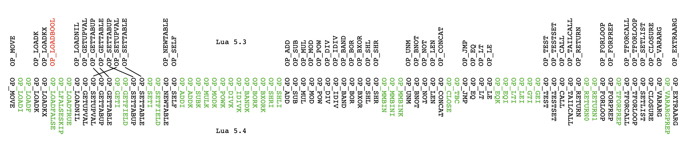

# Lua 5.4之虚拟机指令集

这是Lua 5.4系列的第三篇文章。本系列第一篇文章介绍了Lua 5.4二进制块格式的变化，第二篇文章介绍了Lua 5.4指令编码格式的变化，这篇文章将介绍Lua 5.4虚拟机指令集的变化。

由上一篇文章可知，Lua虚拟机采用定长指令，每条指令占4个字节（可以表示为32位无符号整数）。在Lua 5.3里，操作码占指令低6位，因此总共能够容纳64条指令，定义了47条指令。Lua 5.4将操作码扩展到了7位，因此总共能够容纳128条指令，定义了83条。

总体来说，Lua 5.4增加了37条新指令，去掉了1条指令。Lua 5.4虚拟机指令集总体变化如下图所示（该图兼具缓解劲椎病的效果😊），详细的变化马上会进行介绍（本文假定读者已经熟悉Lua 5.3虚拟机和指令集，如果不太熟悉，可以参考文末列出的学习资料）：




## 加载指令

Lua 5.3共有4条加载指令，其中最主要的是`LOADK`指令，该指令从常量池中加载常量，放入寄存器`A`中。如果常量池索引太大，则需要使用扩展的`LOADKX`指令。`LOADBOOL`和`LOADNIL`指令可以看作是`LOADK`指令的特殊情况，前者直接用指令的参数`B`表示布尔值，后者则可以将`nil`值放入连续`N`个寄存器中。下面是加载指令的操作码在Lua 5.3.6源代码中的定义（注释给出了指令使用的操作数，以及指令执行逻辑的伪代码）：

```c
OP_LOADK,   /* A Bx  R(A) := Kst(Bx)                  */
OP_LOADKX,  /* A     R(A) := Kst(extra arg)           */
OP_LOADBOOL,/* A B C R(A) := (Bool)B; if (C) pc++     */
OP_LOADNIL, /* A B   R(A), R(A+1), ..., R(A+B) := nil */
```

Lua 5.4增加了`LOADI`和`LOADF`指令，可以不使用常量池，直接从指令参数中加载整数和浮点数。并且将`LOADBOOL`指令拆成了三条：`LOADTRUE`、`LOADFALSE`和`LFALSESKIP`。下面是加载指令的操作码在Lua 5.4.1源代码中的定义：

```c
OP_LOADI,     /* A sBx  R[A] := sBx                      */     
OP_LOADF,     /* A sBx  R[A] := (lua_Number)sBx          */
OP_LOADK,     /* A  Bx  R[A] := K[Bx]                    */
OP_LOADKX,    /* A      R[A] := K[extra arg]             */
OP_LOADFALSE, /* A      R[A] := false                    */
OP_LFALSESKIP,/* A      R[A] := false; pc++              */
OP_LOADTRUE,  /* A      R[A] := true                     */
OP_LOADNIL,   /* A B    R[A], R[A+1], ..., R[A+B] := nil */
```

`LOADI`和`LOADF`指令比较好理解，在Lua 5.3里，加载整数和浮点数常量只能使用`LOADK`（或者`LOADKX`）指令，例如：

```
$ luac -l -l -
local a = 123; local b = 456.0
^D
main <stdin:0,0> (3 instructions at 0x7fcc98c06260)
0+ params, 2 slots, 1 upvalue, 2 locals, 2 constants, 0 functions
	1	[1]	LOADK    	0 -1	; 123
	2	[1]	LOADK    	1 -2	; 456.0
	3	[1]	RETURN   	0 1
constants (2) for 0x7fcc98c06260:
	1	123
	2	456.0
locals (2) for 0x7fcc98c06260: 省略
upvalues (1) for 0x7fcc98c06260: 省略
```

在Lua 5.3里，如果整数和浮点数可以被放进参数`sBx`里，那么就可以节约常量池，直接使用`LOADI`和`LOADK`指令，例如（暂时忽略`VARARGPREP`指令，注意常量池的变化）：

```
$ lua-5.4.1/luac -l -l -
local a = 123; local b = 456.0
^D
main <stdin:0,0> (4 instructions at 0x7fa429405890)
0+ params, 2 slots, 1 upvalue, 2 locals, 0 constants, 0 functions
	1	[1]	VARARGPREP	0
	2	[1]	LOADI    	0 123
	3	[1]	LOADF    	1 456
	4	[1]	RETURN   	2 1 1	; 0 out
constants (0) for 0x7fa429405890:
locals (2) for 0x7fcc98c06260: 省略
upvalues (1) for 0x7fcc98c06260: 省略
```

在Lua 5.3里，`LOADBOOL`指令经常是跟在`JMP`指令后成对出现的，参数`C`可以控制是否要跳过下一条指令。下面是一个例子：

```
$ luac -l -l -
local a = 1 > 2
^D
main <stdin:0,0> (5 instructions at 0x7f9ae55040f0)
0+ params, 2 slots, 1 upvalue, 1 local, 2 constants, 0 functions
	1	[1]	LT       	1 -2 -1	; 2 1
	2	[1]	JMP      	0 1	; to 4
	3	[1]	LOADBOOL 	0 0 1
	4	[1]	LOADBOOL 	0 1 0
	5	[1]	RETURN   	0 1
constants (2) for 0x7f9ae55040f0: 省略
locals (1) for 0x7f9ae55040f0: 省略
upvalues (1) for 0x7f9ae55040f0: 省略
```

上面这5条指令的执行逻辑如下图所示：

```
         +------------------------------+
         |                             \|/
LT ---> JMP ---> LOADBOOL(false) ---> LOADBOOL(true) ---> RETURN
|                 /|\  |                                   /|\
+------------------+   +------------------------------------+
```

Lua 5.4去掉了`LOADBOOL`指令，取而代之的是`LOADTRUE`、`LOADFALSE`和`LFALSESKIP`指令。其中`LOADTRUE`和`LOADFALSE`指令分别加载真假值，并且不再跳过下一条指令。`LFALSESKIP`指令加载假值，并且始终跳过下一条指令。用Lua 5.4编译上面的例子：

```
$ lua-5.4.1/luac -l -l -
local a = 1 > 2
^D
main <stdin:0,0> (7 instructions at 0x7fa18a7040f0)
0+ params, 2 slots, 1 upvalue, 1 local, 0 constants, 0 functions
	1	[1]	VARARGPREP	0
	2	[1]	LOADI    	0 2
	3	[1]	LTI      	0 1 1
	4	[1]	JMP      	1	; to 6
	5	[1]	LFALSESKIP	0
	6	[1]	LOADTRUE 	0
	7	[1]	RETURN   	1 1 1	; 0 out
constants (0) for 0x7fa18a7040f0:
locals (1) for 0x7fa18a7040f0: 省略
upvalues (1) for 0x7fa18a7040f0: 省略
```

可以看到，`LT`指令变成了`LOADI`和` LTI`这两条指令，两条`LOADBOOL`指令变成了`LFALSESKIP`和`LOADTRUE`这两条指令。但基本的套路是没变的，这些指令的执行逻辑如下图所示：

```
          +-------------------------+
          |                        \|/
LTI ---> JMP ---> LFALSESKIP ---> LOADTRUE ---> RETURN
|                  /|\  |                         /|\
+-------------------+   +--------------------------+
```


## 算术和按位运算指令

Lua 5.3一共有14条算术（Arithmetic）和按位（Bitwise）运算指令，其中12条是二元（Binary）运算指令，2条是一元（Unary）运算指令。下面是算术和按位运算指令的操作码在Lua 5.3.6源代码中的定义：

```c
OP_ADD,   /* A B C  R(A) := RK(B) +  RK(C)    */
OP_SUB,   /* A B C  R(A) := RK(B) -  RK(C)    */
OP_MUL,   /* A B C  R(A) := RK(B) *  RK(C)    */
OP_MOD,   /* A B C  R(A) := RK(B) %  RK(C)    */
OP_POW,   /* A B C  R(A) := RK(B) ^  RK(C)    */
OP_DIV,   /* A B C  R(A) := RK(B) /  RK(C)    */
OP_IDIV,  /* A B C  R(A) := RK(B) // RK(C)    */
OP_BAND,  /* A B C  R(A) := RK(B) &  RK(C)    */
OP_BOR,   /* A B C  R(A) := RK(B) |  RK(C)    */
OP_BXOR,  /* A B C  R(A) := RK(B) ~  RK(C)    */
OP_SHL,   /* A B C  R(A) := RK(B) << RK(C)    */
OP_SHR,   /* A B C  R(A) := RK(B) >> RK(C)    */
OP_UNM,   /* A B    R(A) := -R(B)             */
OP_BNOT,  /* A B    R(A) := ~R(B)             */
```

下面是这14条指令的操作码在Lua 5.4.1源代码中的定义：

```c
OP_ADD,   /* A B C  R[A] := R[B] +  R[C]      */
OP_SUB,   /* A B C  R[A] := R[B] -  R[C]      */
OP_MUL,   /* A B C  R[A] := R[B] *  R[C]      */
OP_MOD,   /* A B C  R[A] := R[B] %  R[C]      */
OP_POW,   /* A B C  R[A] := R[B] ^  R[C]      */
OP_DIV,   /* A B C  R[A] := R[B] /  R[C]      */
OP_IDIV,  /* A B C  R[A] := R[B] // R[C]      */
OP_BAND,  /* A B C  R[A] := R[B] &  R[C]      */
OP_BOR,   /* A B C  R[A] := R[B] |  R[C]      */
OP_BXOR,  /* A B C  R[A] := R[B] ~  R[C]      */
OP_SHL,   /* A B C  R[A] := R[B] << R[C]      */
OP_SHR,   /* A B C  R[A] := R[B] >> R[C]      */
OP_UNM,   /* A B    R[A] := -R[B]             */
OP_BNOT,  /* A B    R[A] := ~R[B]             */
```

可以看到，主要是参数`B`和`C`的解释发生了变化。二元算术和按位运算指令的参数`B`和`C`在Lua 5.3里可以是寄存器或者常量池索引（由参数的最高位决定，详见上一篇文章），在Lua 5.4里仅表示寄存器索引。此外，Lua 5.4新增加了13条算术和按位指令。其中3条指令将参数`C`解释为有符号整数值，从而节约一次寄存器操作，下面是这3条指令操作码的定义：

```c
OP_ADDI,/* A B sC  R[A] := R[B] + sC  */
OP_SHRI,/* A B sC  R[A] := R[B] >> sC */
OP_SHLI,/* A B sC  R[A] := sC << R[B] */
```

其余10条新增指令将操作数`C`解释为常量池索引，下面是这10条指令操作码的定义：

```c
OP_ADDK, /* A B C  R[A] := R[B] +  K[C]         */
OP_SUBK, /* A B C  R[A] := R[B] -  K[C]         */
OP_MULK, /* A B C  R[A] := R[B] *  K[C]         */
OP_MODK, /* A B C  R[A] := R[B] %  K[C]         */
OP_POWK, /* A B C  R[A] := R[B] ^  K[C]         */
OP_DIVK, /* A B C  R[A] := R[B] /  K[C]         */
OP_IDIVK,/* A B C  R[A] := R[B] // K[C]         */
OP_BANDK,/* A B C  R[A] := R[B] &  K[C]:integer */
OP_BORK, /* A B C  R[A] := R[B] |  K[C]:integer */
OP_BXORK,/* A B C  R[A] := R[B] ~  K[C]:integer */
```

算术和按位运算指令较多，本文仅以加法指令为例进行说明。下面这个例子展示了`ADD`指令在Lua 5.3里的用法：

```
$ luac -l -l -
local a = 1; local b = a + 2
^D
main <stdin:0,0> (3 instructions at 0x7fec31d040f0)
0+ params, 2 slots, 1 upvalue, 2 locals, 2 constants, 0 functions
	1	[1]	LOADK    	0 -1	; 1
	2	[1]	ADD      	1 0 -2	; - 2
	3	[1]	RETURN   	0 1
constants (2) for 0x7fec31d040f0:
	1	1
	2	2
locals (2) for 0x7f8b24604ac0: 省略
upvalues (1) for 0x7f8b24604ac0: 省略
```

如果加法操作的其中一个操作数是比较小（可以放进指令参数`C`）的整数字面值，Lua 5.4编译器将生成`ADDI`指令，如下所示：

```
$ lua-5.4.1/luac -l -l -
local a = 1; local b = a + 2
^D
main <stdin:0,0> (5 instructions at 0x7fea53d040f0)
0+ params, 2 slots, 1 upvalue, 2 locals, 0 constants, 0 functions
	1	[1]	VARARGPREP	0
	2	[1]	LOADI    	0 1
	3	[1]	ADDI     	1 0 2
	4	[1]	MMBINI   	0 2 6 0	; __add
	5	[1]	RETURN   	2 1 1	; 0 out
constants (0) for 0x7fea53d040f0:
locals (2) for 0x7fea53d040f0: 省略
upvalues (1) for 0x7fea53d040f0: 省略
```

但如果整数字面值比较大（无法放进指令参数`C`），Lua 5.4编译器就只能生成`ADDK`指令了，如下所示（注意常量池的变化）：

```
$ lua-5.4.1/luac -l -l -
local a = 1; local b = a + 123456
^D
main <stdin:0,0> (5 instructions at 0x7f906ed040f0)
0+ params, 2 slots, 1 upvalue, 2 locals, 1 constant, 0 functions
	1	[1]	VARARGPREP	0
	2	[1]	LOADI    	0 1
	3	[1]	ADDK     	1 0 0	; 123456
	4	[1]	MMBINK   	0 0 6 0	; __add 123456
	5	[1]	RETURN   	2 1 1	; 0 out
constants (1) for 0x7f906ed040f0:
	0	I	123456
locals (2) for 0x7f906ed040f0: 省略
upvalues (1) for 0x7f906ed040f0: 省略
```

如果加法操作的两个操作数都只能从寄存器取，那Lua 5.4编译器就只能生成普通的`ADD`指令了，如下所示：

```
$ lua-5.4.1/luac -l -l -
local a,b; local c = a + b
^D
main <stdin:0,0> (5 instructions at 0x7fc91dd040f0)
0+ params, 3 slots, 1 upvalue, 3 locals, 0 constants, 0 functions
	1	[1]	VARARGPREP	0
	2	[1]	LOADNIL  	0 1	; 2 out
	3	[1]	ADD      	2 0 1
	4	[1]	MMBIN    	0 1 6	; __add
	5	[1]	RETURN   	3 1 1	; 0 out
constants (0) for 0x7fc91dd040f0:
locals (3) for 0x7fc91dd040f0: 省略
upvalues (1) for 0x7fc91dd040f0: 省略
```

请注意在Lua 5.4编译器生成的代码中，`ADDI`指令后面跟着一个`MMBINI`指令，`ADDK`指令后面跟着一个`MMBINK`指令，`ADD`指令后面跟着一个`MMBIN`指令。这也是Lua 5.4的变化之一。在Lua 5.3中，元方法（Metamethod）是由相关指令（例如`ADD`指令对应`__add`元方法）隐式支持的。在Lua 5.4中，二元运算元方法由3条专门的指令显式支持。后续文章将专门介绍Lua 5.4元方法，下面是这3条元方法指令的操作码在Lua 5.4.1源代码中的定义：

```c
OP_MMBIN, /* A  B C    call C metamethod over R[A] and R[B] */
OP_MMBINI,/* A sB C k  call C metamethod over R[A] and sB   */
OP_MMBINK,/* A  B C k  call C metamethod over R[A] and K[B] */
```


## 比较运算指令

比较运算指令的变化和算术运算指令类似。Lua 5.3一共有3条比较运算指令，下面是这3条指令的操作码在Lua 5.3.6源代码中的定义：

```c
OP_EQ,/* A B C  if ((RK(B) == RK(C)) ~= A) then pc++ */
OP_LT,/* A B C  if ((RK(B) <  RK(C)) ~= A) then pc++ */
OP_LE,/* A B C  if ((RK(B) <= RK(C)) ~= A) then pc++ */
```

在Lua 5.4里，进行比较的操作数由指令的参数`A`和`B`指定，且这两个参数表示的都是寄存器索引。另外，比较操作的期望值由指令的标志位`k`指定。下面是这3条指令的操作码在Lua 5.4.1源代码中的定义：

```c
OP_EQ,/* A B k  if ((R[A] == R[B]) ~= k) then pc++ */
OP_LT,/* A B k  if ((R[A] <  R[B]) ~= k) then pc++ */
OP_LE,/* A B k  if ((R[A] <= R[B]) ~= k) then pc++ */
```

Lua 5.4新增加了6条比较运算指令，其中1条指令的参数`B`被解释为常量池索引，其余5条指令的操作数`B`被解释为有符号整数。下面是这6条指令操作码的定义：

```c
OP_EQK,/* A  B k  if ((R[A] == K[B]) ~= k) then pc++ */
OP_EQI,/* A sB k  if ((R[A] == sB)   ~= k) then pc++ */
OP_LTI,/* A sB k  if ((R[A] <  sB)   ~= k) then pc++ */
OP_LEI,/* A sB k  if ((R[A] <= sB)   ~= k) then pc++ */
OP_GTI,/* A sB k  if ((R[A] >  sB)   ~= k) then pc++ */
OP_GEI,/* A sB k  if ((R[A] >= sB)   ~= k) then pc++ */
```

以“等于”比较为例，下面这个例子展示了`EQ`指令在Lua 5.3里的用法：

```
$ luac -l -l -
local a = 1; local b = a == 2
^D
main <stdin:0,0> (6 instructions at 0x7fd8c15040f0)
0+ params, 2 slots, 1 upvalue, 2 locals, 2 constants, 0 functions
	1	[1]	LOADK    	0 -1	; 1
	2	[1]	EQ       	1 0 -2	; - 2
	3	[1]	JMP      	0 1	; to 5
	4	[1]	LOADBOOL 	1 0 1
	5	[1]	LOADBOOL 	1 1 0
	6	[1]	RETURN   	0 1
constants (2) for 0x7fd8c15040f0:
	1	1
	2	2
locals (2) for 0x7fd8c15040f0: 省略
upvalues (1) for 0x7fd8c15040f0: 省略
```

如果其中一个操作数是整数字面值，且可以被放进指令的参数里，那么Lua 5.4编译器会生成`EQI`指令，如下所示：

```
$ lua-5.4.1/luac -l -l -
local a = 1; local b = a == 2
^D
main <stdin:0,0> (7 instructions at 0x7fd70cd040f0)
0+ params, 2 slots, 1 upvalue, 2 locals, 0 constants, 0 functions
	1	[1]	VARARGPREP	0
	2	[1]	LOADI    	0 1
	3	[1]	EQI      	0 2 1
	4	[1]	JMP      	1	; to 6
	5	[1]	LFALSESKIP	1
	6	[1]	LOADTRUE 	1
	7	[1]	RETURN   	2 1 1	; 0 out
constants (0) for 0x7fd70cd040f0: 省略
locals (2) for 0x7fd70cd040f0: 省略
upvalues (1) for 0x7fd70cd040f0: 省略
```

如果字面值超过了指令参数的表示范围，那么Lua 5.4编译器会生成`EQK`指令，如下所示：

```
$ lua-5.4.1/luac -l -l -
local a = 1; local b = a == 123456
^D
main <stdin:0,0> (7 instructions at 0x7fe6a0c05890)
0+ params, 2 slots, 1 upvalue, 2 locals, 1 constant, 0 functions
	1	[1]	VARARGPREP	0
	2	[1]	LOADI    	0 1
	3	[1]	EQK      	0 0 1	; 123456
	4	[1]	JMP      	1	; to 6
	5	[1]	LFALSESKIP	1
	6	[1]	LOADTRUE 	1
	7	[1]	RETURN   	2 1 1	; 0 out
constants (1) for 0x7fe6a0c05890:
	0	I	123456
locals (2) for 0x7fe6a0c05890: 省略
upvalues (1) for 0x7fe6a0c05890: 省略
```


## 逻辑运算指令

Lua语言中的逻辑运算符（`not`、`and`、`or`）由3条逻辑运算指令实现，下面是这3条指令的操作码在Lua 5.3.6源代码中的定义：

```c
OP_NOT,    /* A B    R(A) := not R(B)                            */
OP_TEST,   /* A C    if not (R(A) <=> C) then pc++               */
OP_TESTSET,/* A B C  if (R(B) <=> C) then R(A) := R(B) else pc++ */
```

逻辑运算指令在Lua 5.4里变化不大，下面是这3条指令的操作码在Lua 5.4.1源代码中的定义：

```c
OP_NOT,    /* A B    R[A] := not R[B]                               */
OP_TEST,   /* A   k  if (not R[A] == k) then pc++                   */
OP_TESTSET,/* A B k  if (not R[B] == k) then pc++ else R[A] := R[B] */
```

逻辑运算指令的差异这里就不展开介绍了，下面这个例子展示了逻辑运算指令在Lua 5.3里的用法：

```
$ luac -l -l -
local a,b; local c = a and b or not c
^D
main <stdin:0,0> (8 instructions at 0x7fdbeac06260)
0+ params, 3 slots, 1 upvalue, 3 locals, 1 constant, 0 functions
	1	[1]	LOADNIL  	0 1
	2	[1]	TEST     	0 0
	3	[1]	JMP      	0 2	; to 6
	4	[1]	TESTSET  	2 1 1
	5	[1]	JMP      	0 2	; to 8
	6	[1]	GETTABUP 	2 0 -1	; _ENV "c"
	7	[1]	NOT      	2 2
	8	[1]	RETURN   	0 1
constants (1) for 0x7fdbeac06260: 省略
locals (3) for 0x7fdbeac06260: 省略
upvalues (1) for 0x7fdbeac06260: 省略
```

上面的示例代码用Lua 5.4编译器编译后基本大同小异，如下所示：

```
$ lua-5.4.1/luac -l -l -
local a,b; local c = a and b or not c
^D
main <stdin:0,0> (9 instructions at 0x7ffb0ed040f0)
0+ params, 3 slots, 1 upvalue, 3 locals, 1 constant, 0 functions
	1	[1]	VARARGPREP	0
	2	[1]	LOADNIL  	0 1	; 2 out
	3	[1]	TEST     	0 0
	4	[1]	JMP      	2	; to 7
	5	[1]	TESTSET  	2 1 1
	6	[1]	JMP      	2	; to 9
	7	[1]	GETTABUP 	2 0 0	; _ENV "c"
	8	[1]	NOT      	2 2
	9	[1]	RETURN   	3 1 1	; 0 out
constants (1) for 0x7ffb0ed040f0: 省略
locals (3) for 0x7ffb0ed040f0: 省略
upvalues (1) for 0x7ffb0ed040f0: 省略
```


## 表操作指令

Lua 5.3里有4条表操作指令，下面是这4条指令的操作码在Lua 5.3.6源代码中的定义：

```c
OP_GETTABLE,/* A B C  R(A) := R(B)[RK(C)]                      */
OP_SETTABLE,/* A B C  R(A)[RK(B)] := RK(C)                     */
OP_NEWTABLE,/* A B C  R(A) := {} (size = B,C)                  */
OP_SETLIST, /* A B C  R(A)[(C-1)*FPF+i] := R(A+i), 1 <= i <= B */
```

这4条指令在Lua 5.4里大同小异，下面是这4条指令的操作码在Lua 5.4.1源代码中的定义：

```c
OP_GETTABLE,/* A B C    R[A] := R[B][R[C]]                       */
OP_SETTABLE,/* A B C    R[A][R[B]] := RK(C)                      */
OP_NEWTABLE,/* A B C k  R[A] := {}                               */
OP_SETLIST, /* A B C k  R[A][(C-1)*FPF+i] := R[A+i], 1 <= i <= B */
```

这4条指令在参数的解释和实现细节上都有差异，例如变化较大的`OP_NEWTABLE`指令，在Lua 5.4里它的后面必须跟一条`EXTRAARG`指令，其他细节这里就不展开讨论了。本文重点介绍Lua 5.4新增加的4条表操作指令，下面是这4条指令的操作码在Lua 5.4.1源代码中的定义：

```c
OP_GETI,    /* A B C    R[A] := R[B][C]            */
OP_GETFIELD,/* A B C    R[A] := R[B][K[C]:string]  */
OP_SETI,    /* A B C    R[A][B] := RK(C)           */
OP_SETFIELD,/* A B C    R[A][K[B]:string] := RK(C) */
```

我们通过一个例子来了解一下`SETI`和`GETI`指令，下面是这个例子在Lua 5.3里的编译结果：

```
$ luac -l -l -
local t = {}; t[0] = 1; local a = t[0]
^D
main <stdin:0,0> (4 instructions at 0x7f943dc04e60)
0+ params, 2 slots, 1 upvalue, 2 locals, 2 constants, 0 functions
	1	[1]	NEWTABLE 	0 0 0
	2	[1]	SETTABLE 	0 -1 -2	; 0 1
	3	[1]	GETTABLE 	1 0 -1	; 0
	4	[1]	RETURN   	0 1
constants (2) for 0x7f943dc04e60: 省略
locals (2) for 0x7f943dc04e60: 省略
upvalues (1) for 0x7f943dc04e60: 省略
```

由于是进行数组操作，且索引是比较小的整数值，所以在Lua 5.4里会生成`SETI`和`GETI`指令，如下所示：

```
$ lua-5.4.1/luac -l -l -
local t = {}; t[0] = 1; local a = t[0]
^D
main <stdin:0,0> (6 instructions at 0x7f9fc46040f0)
0+ params, 2 slots, 1 upvalue, 2 locals, 1 constant, 0 functions
	1	[1]	VARARGPREP	0
	2	[1]	NEWTABLE 	0 0 0	; 0
	3	[1]	EXTRAARG 	0
	4	[1]	SETI     	0 0 0k	; 1
	5	[1]	GETI     	1 0 0
	6	[1]	RETURN   	2 1 1	; 0 out
constants (1) for 0x7f9fc46040f0: 省略
locals (2) for 0x7f9fc46040f0: 省略
upvalues (1) for 0x7f9fc46040f0: 省略
```

顺便可以看到，在Lua 5.4里，`NEWTABLE`指令后面跟了一条`EXTRAARG`指令。下面这个例子可以帮助我们了解`SETFIELD`和`GETFIELD`指令，先来看Lua 5.3的编译结果：

```
$ luac -l -l -
local t = {}; t.k = 1; local a = t.k
^D
main <stdin:0,0> (4 instructions at 0x7f90025040f0)
0+ params, 2 slots, 1 upvalue, 2 locals, 2 constants, 0 functions
	1	[1]	NEWTABLE 	0 0 0
	2	[1]	SETTABLE 	0 -1 -2	; "k" 1
	3	[1]	GETTABLE 	1 0 -1	; "k"
	4	[1]	RETURN   	0 1
constants (2) for 0x7f90025040f0:
	1	"k"
	2	1
locals (2) for 0x7f90025040f0: 省略
upvalues (1) for 0x7f90025040f0: 省略
```

由于是进行哈希表操作（key是字符串），所以在Lua 5.4里会生成`SETFIELD`和`GETFIELD`指令，如下所示：

```
$ lua-5.4.1/luac -l -l -
local t = {}; t.k = 1; local a = t.k
^D
main <stdin:0,0> (6 instructions at 0x7fa77ec062c0)
0+ params, 2 slots, 1 upvalue, 2 locals, 2 constants, 0 functions
	1	[1]	VARARGPREP	0
	2	[1]	NEWTABLE 	0 0 0	; 0
	3	[1]	EXTRAARG 	0
	4	[1]	SETFIELD 	0 0 1k	; "k" 1
	5	[1]	GETFIELD 	1 0 0	; "k"
	6	[1]	RETURN   	2 1 1	; 0 out
constants (2) for 0x7fa77ec062c0:
	0	S	"k"
	1	I	1
locals (2) for 0x7fa77ec062c0: 省略
upvalues (1) for 0x7fa77ec062c0: 省略
```


## for循环指令

Lua语言支持两种类型的`for`循环：数值`for`循环和通用`for`循环。数值`for`循环用于在两个数值范围内按照一定的步长进行迭代，通用`for`循环常用于对表进行迭代。本文不展开介绍这两种循环的语法，仅给出一个例子：

```lua
-- 数值for循环
for i = 1, 10 do
  print(i)
end

-- 通用for循环
local t = {a=1,b=2,c=3}
for k,v in pairs(t) do
  print(k,v)
end
```

Lua 5.3为这两种循环专门定义了4条指令，其中`FORPREP`和`FORLOOP`指令用于实现数值`for`循环，`TFORCALL`和`TFORLOOP`指令用于实现通用`for`循环。下面是这4条指令的操作码在Lua 5.3.6源代码中的定义：

```c
OP_FORLOOP, /* A sBx    R(A)+=R(A+2); if R(A) <?= R(A+1) then { pc+=sBx; R(A+3)=R(A) } */
OP_FORPREP, /* A sBx    R(A)-=R(A+2); pc+=sBx                                          */

OP_TFORCALL,/* A     C  R(A+3), ... ,R(A+2+C) := R(A)(R(A+1), R(A+2));                 */
OP_TFORLOOP,/* A sBx    if R(A+1) ~= nil then { R(A)=R(A+1); pc += sBx }               */
```

这4条指令的参数和执行逻辑在Lua 5.4里略有调整，另外，Lua 5.4给通用`for`循环增加了一条`TFORPREP`指令（后面会详细说明）。下面是这5条指令的操作码在Lua 5.4.1源代码中的定义：

```c
OP_FORLOOP, /* A Bx    update counters; if loop continues then pc-=Bx;                   */
OP_FORPREP, /* A Bx    <check values and prepare counters>; if not to run then pc+=Bx+1; */

OP_TFORPREP,/* A Bx    create upvalue for R[A + 3]; pc+=Bx                               */
OP_TFORCALL,/* A    C  R[A+4], ... ,R[A+3+C] := R[A](R[A+1], R[A+2]);                    */
OP_TFORLOOP,/* A Bx    if R[A+4] ~= nil then { R[A+2]=R[A+4]; pc -= Bx }                 */
```

数值`for`循环指令变化较小，本文不再展开介绍。前面例子中的数值`for`循环语句在Lua 5.3里的编译结果如下所示：

```
$ luac -l -l -
for i = 1, 10 do print(i) end
^D
main <stdin:0,0> (9 instructions at 0x7fceded04ac0)
0+ params, 6 slots, 1 upvalue, 4 locals, 3 constants, 0 functions
	1	[1]	LOADK    	0 -1	; 1
	2	[1]	LOADK    	1 -2	; 10
	3	[1]	LOADK    	2 -1	; 1
	4	[1]	FORPREP  	0 3	; to 8
	5	[1]	GETTABUP 	4 0 -3	; _ENV "print"
	6	[1]	MOVE     	5 3
	7	[1]	CALL     	4 2 1
	8	[1]	FORLOOP  	0 -4	; to 5
	9	[1]	RETURN   	0 1
constants (3) for 0x7fceded04ac0:
	1	1
	2	10
	3	"print"
locals (4) for 0x7fceded04ac0:
	0	(for index)	4	9
	1	(for limit)	4	9
	2	(for step)	4	9
	3	i	5	8
upvalues (1) for 0x7fceded04ac0:
	0	_ENV	1	0
```

在Lua 5.4里的编译结果大同小异，如下所示：

```
$ lua-5.4.1/luac -l -l -
for i = 1, 10 do print(i) end
^D
main <stdin:0,0> (10 instructions at 0x7f8b627040f0)
0+ params, 6 slots, 1 upvalue, 4 locals, 1 constant, 0 functions
	1	[1]	VARARGPREP	0
	2	[1]	LOADI    	0 1
	3	[1]	LOADI    	1 10
	4	[1]	LOADI    	2 1
	5	[1]	FORPREP  	0 3	; to 9
	6	[1]	GETTABUP 	4 0 0	; _ENV "print"
	7	[1]	MOVE     	5 3
	8	[1]	CALL     	4 2 1	; 1 in 0 out
	9	[1]	FORLOOP  	0 4	; to 6
	10	[1]	RETURN   	0 1 1	; 0 out
constants (1) for 0x7f8b627040f0:
	0	S	"print"
locals (4) for 0x7f8b627040f0:
	0	(for state)	5	10
	1	(for state)	5	10
	2	(for state)	5	10
	3	i	6	9
upvalues (1) for 0x7f8b627040f0:
	0	_ENV	1	0
```

前面例子中的通用`for`循环语句在Lua 5.3里的编译结果如下所示：

```
$ luac -l -l -
for k,v in pairs({a=1,b=2,c=3}) do print(k,v) end
^D
main <stdin:0,0> (14 instructions at 0x7fc086c06260)
0+ params, 8 slots, 1 upvalue, 5 locals, 8 constants, 0 functions
	1	[1]	GETTABUP 	0 0 -1	; _ENV "pairs"
	2	[1]	NEWTABLE 	1 0 3
	3	[1]	SETTABLE 	1 -2 -3	; "a" 1
	4	[1]	SETTABLE 	1 -4 -5	; "b" 2
	5	[1]	SETTABLE 	1 -6 -7	; "c" 3
	6	[1]	CALL     	0 2 4
	7	[1]	JMP      	0 4	; to 12
	8	[1]	GETTABUP 	5 0 -8	; _ENV "print"
	9	[1]	MOVE     	6 3
	10	[1]	MOVE     	7 4
	11	[1]	CALL     	5 3 1
	12	[1]	TFORCALL 	0 2
	13	[1]	TFORLOOP 	2 -6	; to 8
	14	[1]	RETURN   	0 1
constants (8) for 0x7fc086c06260:
	1	"pairs"
	2	"a"
	3	1
	4	"b"
	5	2
	6	"c"
	7	3
	8	"print"
locals (5) for 0x7fc086c06260:
	0	(for generator)	7	14
	1	(for state)	7	14
	2	(for control)	7	14
	3	k	8	12
	4	v	8	12
upvalues (1) for 0x7fc086c06260:
	0	_ENV	1	0
```

请注意通用`for`循环的第一条指令是`JMP`指令，该指令导致逻辑直接跳到了`TFORCALL`指令。在Lua 5.3里，`JMP`指令除了起跳转作用，还兼顾关闭upvalue的作用。在Lua 5.4里，`JMP`指令不再负责关闭upvalue（这一点后文还会再详细介绍）。于是在Lua 5.4里，通用`for`循环的第一条`JMP`指令被换成了`TFORPREP`指令。前面的例子在Lua 5.4里的编译结果如下所示：

```
$ lua-5.4.1/luac -l -l -
for k,v in pairs({a=1,b=2,c=3}) do print(k,v) end
^D
main <stdin:0,0> (17 instructions at 0x7fe855d040f0)
0+ params, 9 slots, 1 upvalue, 6 locals, 8 constants, 0 functions
	1	[1]	VARARGPREP	0
	2	[1]	GETTABUP 	0 0 0	; _ENV "pairs"
	3	[1]	NEWTABLE 	1 3 0	; 0
	4	[1]	EXTRAARG 	0
	5	[1]	SETFIELD 	1 1 2k	; "a" 1
	6	[1]	SETFIELD 	1 3 4k	; "b" 2
	7	[1]	SETFIELD 	1 5 6k	; "c" 3
	8	[1]	CALL     	0 2 5	; 1 in 4 out
	9	[1]	TFORPREP 	0 4	; to 14
	10	[1]	GETTABUP 	6 0 7	; _ENV "print"
	11	[1]	MOVE     	7 4
	12	[1]	MOVE     	8 5
	13	[1]	CALL     	6 3 1	; 2 in 0 out
	14	[1]	TFORCALL 	0 2
	15	[1]	TFORLOOP 	0 6	; to 10
	16	[1]	CLOSE    	0
	17	[1]	RETURN   	0 1 1	; 0 out
constants (8) for 0x7fe855d040f0:
	0	S	"pairs"
	1	S	"a"
	2	I	1
	3	S	"b"
	4	I	2
	5	S	"c"
	6	I	3
	7	S	"print"
locals (6) for 0x7fe855d040f0:
	0	(for state)	9	17
	1	(for state)	9	17
	2	(for state)	9	17
	3	(for state)	9	17
	4	k	10	14
	5	v	10	14
upvalues (1) for 0x7fe855d040f0:
	0	_ENV	1	0
```

除了`TFORPREP`指令，通用`for`循环的实现细节还有其他变化，例如状态变量也多了一个，但本文不再展开讨论。


## Upvalue相关指令

Upvalue是Lua实现特有的一个概念，本文不展开介绍，感兴趣的读者可以参考文末给出的Lua学习资料。Lua 5.3一共有5条指令和upvalue相关，其中4条是专门为upvalue定义的，还有一条就是前文提到的`JMP`指令。下面是这5条指令的操作码在Lua 5.3.6源代码中的定义：

```c
OP_GETUPVAL,/* A B    R(A) := UpValue[B]         */
OP_GETTABUP,/* A B C  R(A) := UpValue[B][RK(C)]  */
OP_SETTABUP,/* A B C  UpValue[A][RK(B)] := RK(C) */
OP_SETUPVAL,/* A B    UpValue[B] := R(A)         */
OP_JMP,     /* A sBx  pc+=sBx; if (A) close all upvalues >= R(A - 1) */
```

除了`JMP`指令不再负责关闭upvalue之外，其余4条指令在Lua 5.4里变化不大。由于`JMP`指令的功能瘦身，Lua 5.4新增加了`CLOSE`指令，专门用于关闭upvalue。下面是这6条指令的操作码在Lua 5.4.1源代码中的定义：

```c
OP_GETUPVAL,/* A B    R[A] := UpValue[B]               */
OP_SETUPVAL,/* A B    UpValue[B] := R[A]               */
OP_GETTABUP,/* A B C  R[A] := UpValue[B][K[C]:string]  */
OP_SETTABUP,/* A B C  UpValue[A][K[B]:string] := RK(C) */
OP_JMP,     /* sJ     pc += sJ */
OP_CLOSE,   /* A      close all upvalues >= R[A] */
```

本文只介绍Lua 5.4新增加的`CLOSE`指令，下面是一段示例代码在Lua 5.3里的编译结果：

```
$ luac -l -l -
do local a,b,c,d; function foo() c = 1 end; end
^D
main <stdin:0,0> (5 instructions at 0x7fcbc6d040f0)
0+ params, 5 slots, 1 upvalue, 4 locals, 1 constant, 1 function
	1	[1]	LOADNIL  	0 3
	2	[1]	CLOSURE  	4 0	; 0x7fcbc6e040e0
	3	[1]	SETTABUP 	0 -1 4	; _ENV "foo"
	4	[1]	JMP      	1 0	; to 5
	5	[1]	RETURN   	0 1
constants (1) for 0x7fcbc6d040f0: 省略
locals (4) for 0x7fcbc6d040f0: 省略
upvalues (1) for 0x7fcbc6d040f0: 省略
```

可以看到，其中有一条JMP指令，它的参数`A`是1，参数`sBx`是0。也就是说，这条`JMP`指令其实并没有起到跳转作用，仅仅用于关闭upvalue。这个例子在Lua 5.4里的编译结果如下所示：

```
$ lua-5.4.1/luac -l -l -
do local a,b,c,d; function foo() c = 1 end; end
^D
main <stdin:0,0> (6 instructions at 0x7ffb535040f0)
0+ params, 5 slots, 1 upvalue, 4 locals, 1 constant, 1 function
	1	[1]	VARARGPREP	0
	2	[1]	LOADNIL  	0 3	; 4 out
	3	[1]	CLOSURE  	4 0	; 0x7ffb537043b0
	4	[1]	SETTABUP 	0 0 4	; _ENV "foo"
	5	[1]	CLOSE    	0
	6	[1]	RETURN   	0 1 1	; 0 out
constants (1) for 0x7ffb535040f0: 省略
locals (4) for 0x7ffb535040f0: 省略
upvalues (1) for 0x7ffb535040f0: 省略
```

可以看到，`JMP`指令被换成了`CLOSE`指令。


## 其他指令

Lua 5.4新增加了[const和to-be-closed变量](http://www.lua.org/manual/5.4/manual.html#3.3.8)，后者由专门的`TBC`指令支持。下面是该指令操作码的定义：

```c
OP_TBC, /* A  mark variable A "to be closed" */
```

`to-be-closed`变量将在下一篇文章中详细介绍，本文仅给出一个例子：

```
$ lua-5.4.1/luac -l -l -
local a <const> = 1
local b <close> = 2
^D
main <stdin:0,0> (4 instructions at 0x7fc6367040f0)
0+ params, 2 slots, 1 upvalue, 1 local, 0 constants, 0 functions
	1	[1]	VARARGPREP	0
	2	[2]	LOADI    	0 2
	3	[2]	TBC      	0
	4	[2]	RETURN   	1 1 1	; 0 out
constants (0) for 0x7fc6367040f0:
locals (1) for 0x7fc6367040f0: 省略
upvalues (1) for 0x7fc6367040f0: 省略
```


## 总结

以上介绍了Lua 5.4指令集（相对于Lua 5.3）主要的变化，前文未覆盖的指令也可能有细微变化，但本文就不展开讨论了。这里再总结一下主要变化：

1. 加载指令
   1. `LOADBOOL`指令被拆分为`LOADTRUE`、`LOADFALSE`和`LFALSESKIP`这3条指令
   2. 增加了`LOADI`和`LOADK`指令，优化寄存器使用
2. 算术和按位运算指令
   1. 原有指令的参数`B`和`C`不再使用RK标志位，仅仅表示寄存器索引
   2. 增加了`ADDI`和`ADDK`等指令，优化寄存器使用
   3. 二元元方法由新增加的`MMBIN`等3条指令显式支持
3. 比较运算指令
   1. 原有指令的参数`B`和`C`不再使用RK标志位，仅仅表示寄存器索引
   2. 增加了`EQI`和`EQK`等指令，优化寄存器使用
4. 表操作指令
   1. `NEWTABLE`指令后面必须跟`EXTRAARG`指令
   2. 增加了`GETI`和`SETI`指令，优化数组索引操作
   3. 增加了`GETFIELD`和`SETFIELD`指令，优化对象字段操作
5. `for`循环指令
   1. 通用`for`循环增加了`TFORPREP`指令，用于跳转+关闭upvalue
6. Upvalue相关指令
   1. `JMP`指令不再负责关闭`upvalue`，新增加了`CLOSE`指令专门用于关闭upvalue
7. 其他
   1. 新增加了`TBC`指令，用于支持语法层面增加的`to-be-closed`变量
   2. 增加了`VARARGPREP`指令


如果读者想进一步了解Lua 5.3的内部工作原理和实现细节（例如各种指令的详细解释，upvalue的概念等），可以阅读我写的《[自己动手实现Lua：虚拟机、编译器和标准库](https://item.jd.com/12458778.html)》一书。如果读者对Java虚拟机感兴趣，可以阅读我写的《[自己动手写Java虚拟机](https://e.jd.com/30231161.html?ebook=1)》一书。如果读者对最近火热的WebAssembly虚拟机感兴趣，可以阅读我最新写的《[WebAssembly原理与核心技术](https://item.jd.com/12998058.html)》一书。


